<div align="center">

# ⚖️ VidhiPath.ai

### AI-powered legal assistant for Indian law

Get instant legal guidance, document validation, case outcome prediction and case summaries — in plain English.


</div>

---

## 📌 Table of Contents

- [About](#-about)
- [Features](#-features)
- [Screenshots](#-screenshots)
- [Tech Stack](#-tech-stack)
- [Project Structure](#-project-structure)
- [Getting Started](#-getting-started)
- [Environment Variables](#-environment-variables)
- [Internship & Credentials](#-internship--credentials)
- [Author](#-author)
- [Disclaimer](#%EF%B8%8F-disclaimer)

---

## 📖 About

**VidhiPath.ai** (*Vidhi* = law, *Path* = way) is a Flask-based legal technology platform that makes Indian legal information easier to access and understand. Users can ask legal questions to an AI assistant, validate legal documents, get AI-assisted case outcome predictions, and turn long legal text into short, readable summaries — all from a single dashboard with saved history.

This project was built as part of the **IamPro – IEEE Computer Society Internship and Mentorship Program 2025**.

---

## ✨ Features

| Feature | Description |
|---|---|
| 💬 **Legal Guidance Chatbot** | Ask legal questions in plain English and get answers grounded in Indian law, powered by the Gemini API. |
| 📄 **Smart Document Checker** | Upload legal documents (PDF, DOCX, TXT) to check format correctness, missing details and potential issues. |
| 📈 **Case Prediction Engine** | Enter case type, year of filing, state and description to get predictions on outcome probability, estimated duration and recommended jurisdiction. |
| 📝 **Case Summary Generator** | Paste text or upload a document and get a clear, easy-to-understand summary. |
| 📚 **Knowledge Base** | Browse legal FAQs and resources. |
| 🔖 **Saved Content** | Revisit chat history, validated documents and case analyses in one place. |
| 📊 **Personal Dashboard** | Quick stats (conversations, documents checked, case analyses), quick actions and usage tips. |
| 🔐 **Authentication & Roles** | Sign up / login, role-based access and an admin panel, backed by MySQL. |
| 🔑 **Forgot Password with OTP** | Email-based 6-digit OTP verification followed by a secure password reset. |

---

## 🖼️ Screenshots

### Landing page

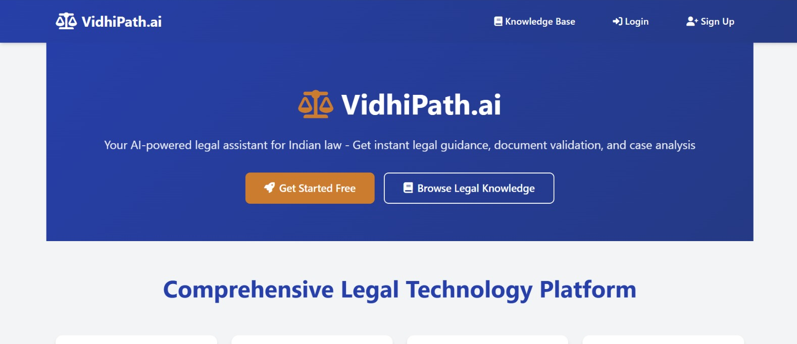

| Platform features | Why choose VidhiPath.ai |
|---|---|
| 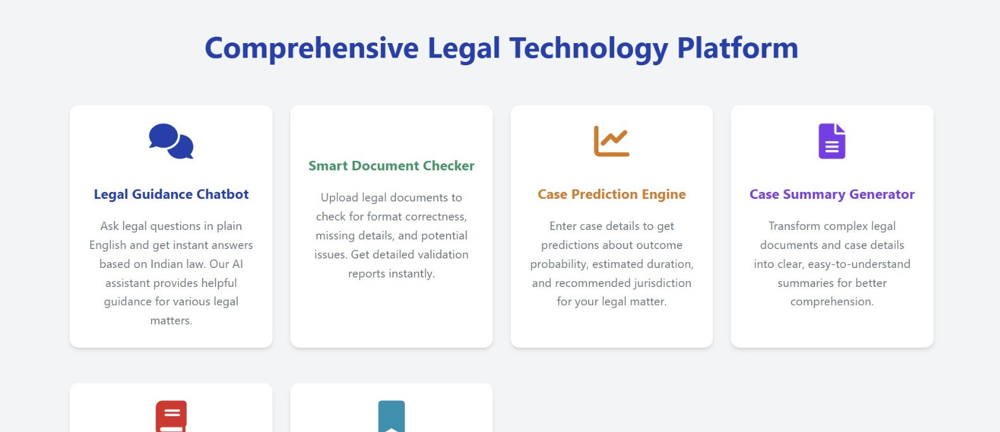 | 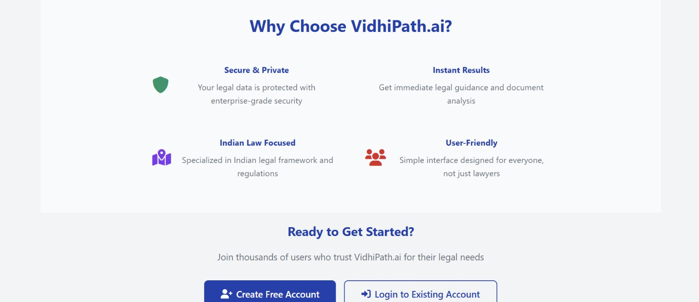 |

### Authentication

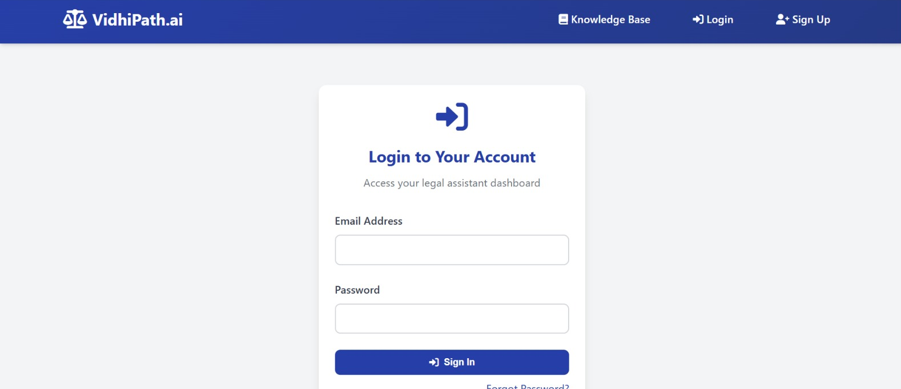

### Dashboard

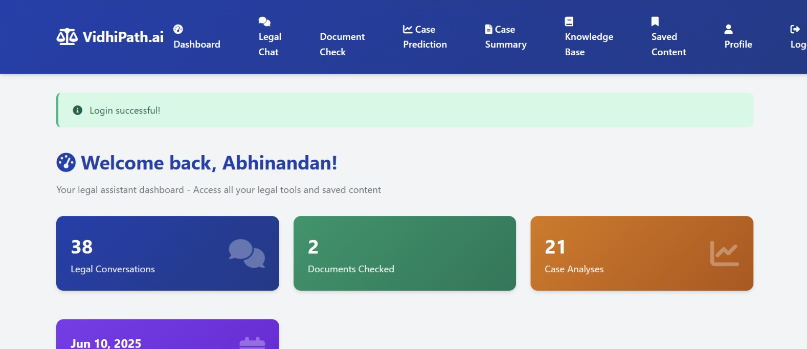

| Quick actions | Recent activity & tips |
|---|---|
| 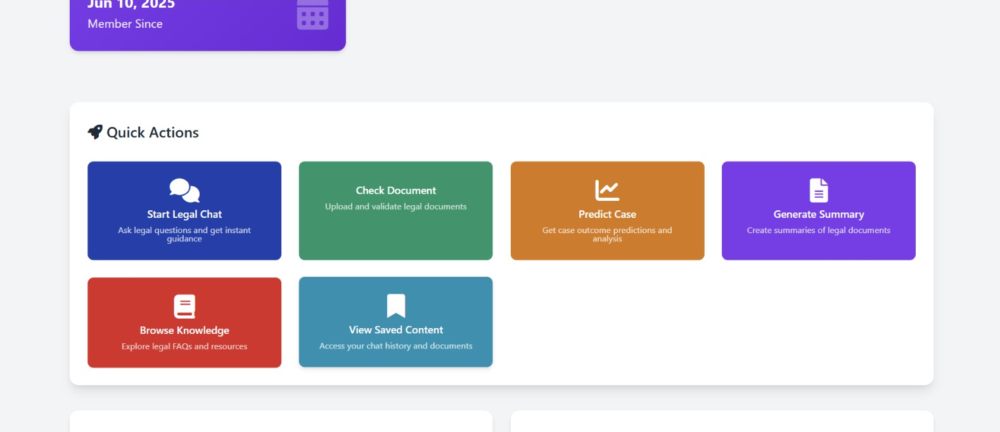 | 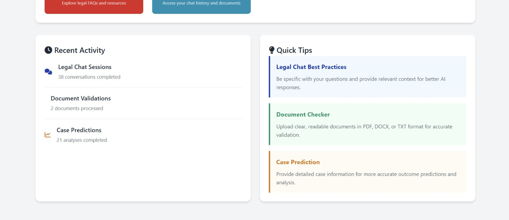 |

### Legal Guidance Chatbot

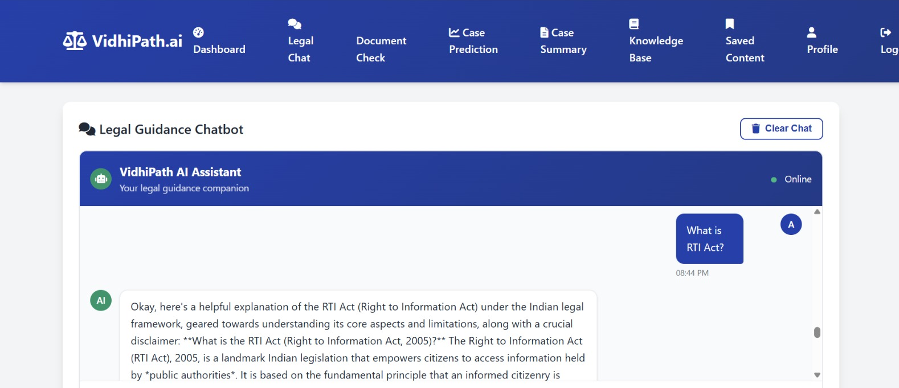

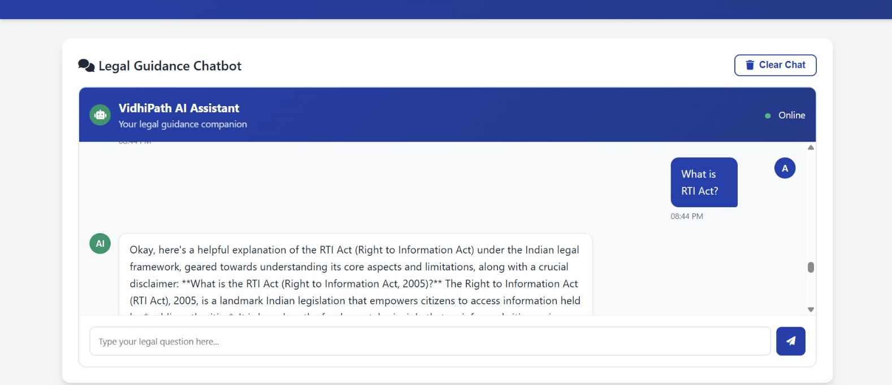

### Case Prediction Engine

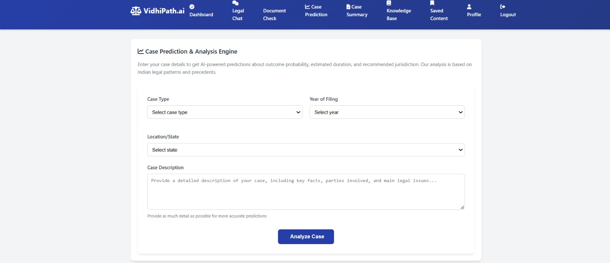

### Case Summary Generator

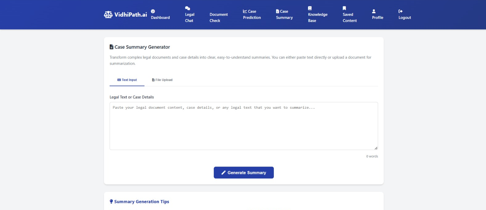

### Saved Content

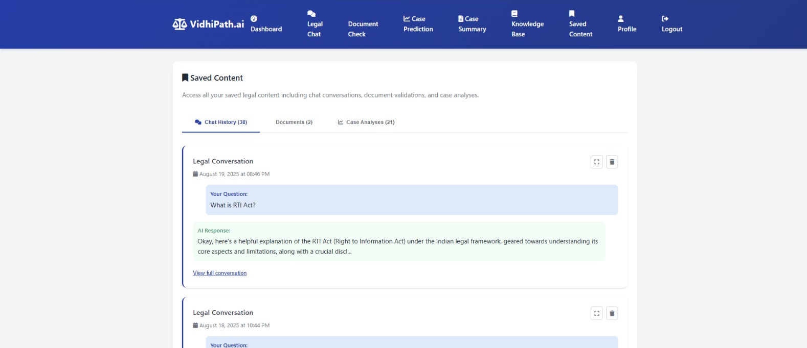

### Password Recovery (OTP flow)

| 1. Forgot password | 2. Verify OTP | 3. Reset password |
|---|---|---|
| 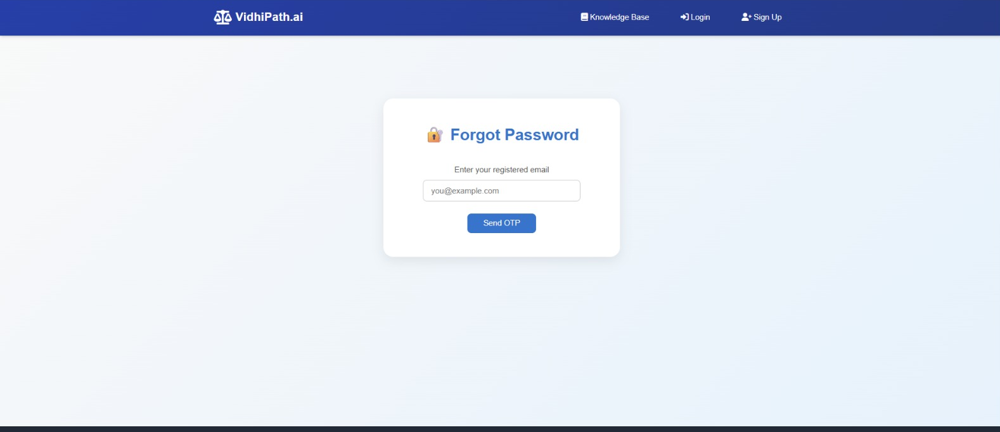 | 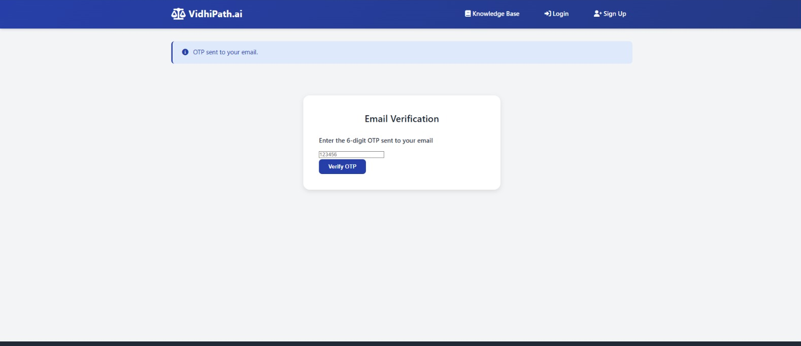 | 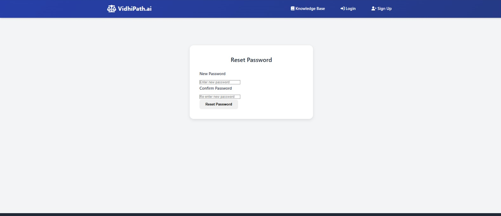 |

---

## 🛠️ Tech Stack

| Layer | Technology |
|---|---|
| **Backend** | Python, Flask |
| **AI / LLM** | Google Gemini API |
| **Database** | MySQL |
| **Frontend** | HTML, CSS, JavaScript (Jinja2 templates) |
| **Auth** | Session-based login with roles, email OTP for password reset |

---

## 📁 Project Structure

> Adjust this to match your repository layout.

```
VidhiPath.ai/
├── app.py                  # Flask application entry point
├── ai_service.py           # AI integration services
├── auth.py                 # Authentication utilities
├── database.py             # Database manager
├── document_processor.py   # Document processing utilities
├── templates/              # HTML templates
├── static/                 # CSS, JS, images
├── screenshots/            # README screenshots
├── certificate.png         # Internship completion certificate
├── requirements.txt
├── .env.example
└── README.md
```

---

---

## 🏗️ Architecture

```mermaid
graph TD
    A[Frontend (HTML/CSS/JS)] --> B[Flask Backend]
    B --> C[MySQL Database]
    B --> D[Google Gemini API]
```

---

## 🚀 Getting Started

### Prerequisites

- Python 3.9+
- MySQL Server
- A Google Gemini API key
- An email account / SMTP credentials (for OTP emails)

### Installation

```bash
# 1. Clone the repository
git clone https://github.com/Abhinandan12317/VidhiPath.ai.git
cd VidhiPath.ai

# 2. Create and activate a virtual environment
python -m venv venv
source venv/bin/activate        # Windows: venv\Scripts\activate

# 3. Install dependencies
pip install -r requirements.txt

# 4. Set up the database
#    Create a MySQL database and update your .env file (see below)

# 5. Run the app
python app.py
```

The app runs at **http://127.0.0.1:5000**

---

## 🔧 Environment Variables

Create a `.env` file in the project root. **Never commit this file** — add it to `.gitignore`.

```env
GEMINI_API_KEY=your_gemini_api_key
SECRET_KEY=your_flask_secret_key

DB_HOST=localhost
DB_USER=your_db_user
DB_PASSWORD=your_db_password
DB_NAME=vidhipath

MAIL_SERVER=smtp.gmail.com
MAIL_PORT=587
MAIL_USERNAME=your_email@example.com
MAIL_PASSWORD=your_app_password
```

---

## 🎓 Internship & Credentials

This project was developed during the:

### **IamPro – IEEE Computer Society Internship and Mentorship Program 2025**

| | |
|---|---|
| **Program** | IamPro – IEEE Computer Society Internship and Mentorship Program |
| **Organised by** | IEEE Computer Society |
| **Year** | 2025 |
| **Intern** | Abhinandan |
| **Project** | VidhiPath.ai — AI-powered Legal Assistant for Indian Law |


### 📜 Internship Completion Certificate

<div align="center">

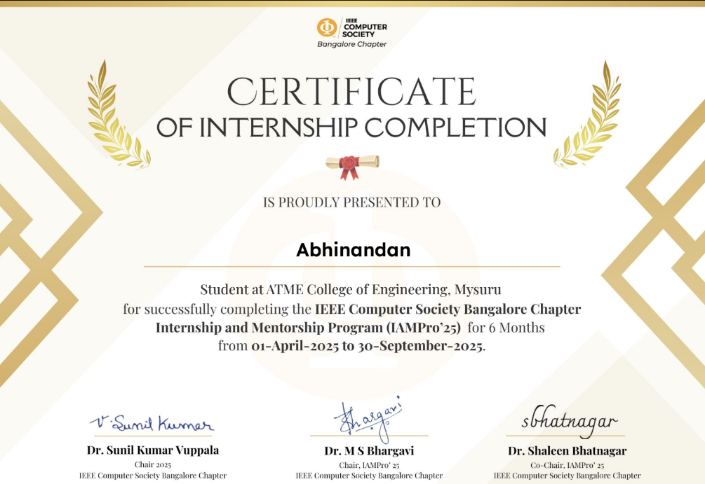

</div>

---

## 👨‍💻 Author

**Abhinandan**
Final-year Computer Science & Engineering student, ATME College of Engineering, Mysore
Team **Double.exe**

| | |
|---|---|
| **GitHub** | [@Abhinandan12317](https://github.com/Abhinandan12317) |


---

## ⚠️ Disclaimer

VidhiPath.ai provides AI-generated information for **educational and informational purposes only**. It is **not a substitute for professional legal advice**. Case predictions are estimates and should not be relied upon for legal decisions. Always consult a qualified legal professional.

---

<div align="center">

⭐ If you found this project useful, consider giving it a star!

</div>
